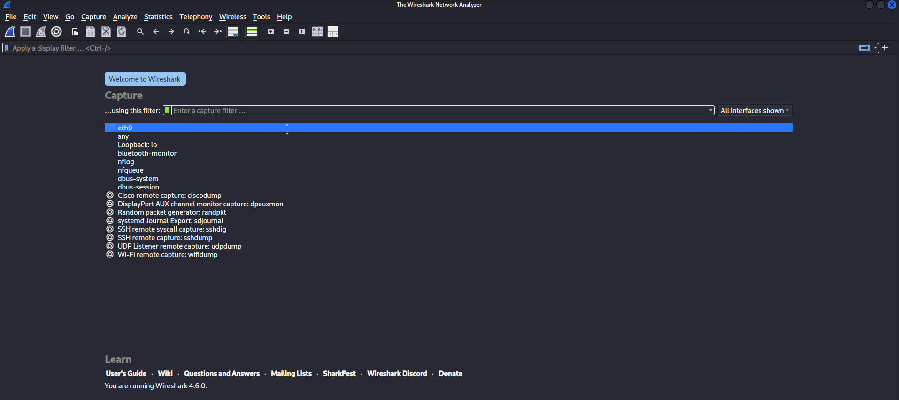

# **Task 5: Capture and Analyze Network Traffic Using Wireshark**

---

## . Objective

To capture live network traffic using Wireshark, analyze different network protocols, and understand how data packets travel across a network.

---

## . Tool Used

* Wireshark (Network Protocol Analyzer)
* Operating System: Windows / Linux
* Active Interface: Wi-Fi

---


 Step 1: Install Wireshark
🔹 Windows:

Official website se download karo:
👉 https://www.wireshark.org

Install normally (Npcap install karna mandatory hai).

🔹 Linux (Ubuntu) or kali linux:
```bash
sudo apt update
sudo apt install wireshark
```



---

## Step 2: Select Network Interface

* Opened Wireshark.
* Selected active network interface (Wi-Fi/Ethernet).
* Started packet capture.

📸 **Screenshot 2 Required:**
👉 *Wireshark showing available interfaces before starting capture.*

📸 **Screenshot 3 Required:**
👉 *Wireshark capturing live packets (packets scrolling).*

---

## Step 3: Generate Network Traffic

* Opened a web browser and visited google.com.
* Used ping command to generate ICMP traffic:

**Windows:**

```
ping google.com
```

**Linux:**

```
ping google.com
```

📸 **Screenshot 4 Required:**
👉 *Command Prompt showing successful ping replies.*

---

## Step 4: Stop Capture

* Stopped packet capture after approximately 1 minute.

📸 **Screenshot 5 Required:**
👉 *Captured packets visible after stopping capture.*

---

## Step 5: Apply Protocol Filters

Applied the following filters in the filter bar:

* `dns`
* `tcp`
* `http`
* `icmp`

📸 **Screenshot 6 Required:**
👉 *DNS filter applied showing DNS packets.*

📸 **Screenshot 7 Required:**
👉 *TCP filter applied showing TCP handshake packets.*

📸 **Screenshot 8 Required:**
👉 *ICMP filter applied showing Echo Request and Echo Reply.*

(If HTTP visible, add one more screenshot.)

---

## Step 6: Protocol Hierarchy Statistics

* Navigated to:

  ```
  Statistics → Protocol Hierarchy
  ```
* Observed distribution of protocols.

📸 **Screenshot 9 Required:**
👉 *Protocol Hierarchy window showing percentage of TCP, UDP, DNS, etc.*

---

## Step 7: Export Capture File

* Clicked:

  ```
  File → Save As
  ```
* Saved file as:

  ```
  network_capture.pcapng
  ```

📸 **Screenshot 10 Required:**
👉 *Save As window showing .pcapng format selected.*

---

# 4. Protocols Identified

### 1. DNS

* Used for domain name resolution.
* Observed query and response packets.
* Uses UDP port 53.

### 2. TCP

* Observed 3-way handshake:

  * SYN
  * SYN-ACK
  * ACK
* Provides reliable communication.

### 3. HTTPS

* Encrypted web traffic.
* Observed communication over port 443.

### 4. ICMP

* Echo Request and Echo Reply observed.
* Used to test connectivity.

---

# 5. Findings

* DNS requests occur before establishing web connections.
* TCP handshake confirms session establishment.
* HTTPS encrypts communication between client and server.
* ICMP verifies network connectivity.

---

# 6. Conclusion

The experiment successfully demonstrated live packet capture and protocol analysis using Wireshark. Multiple protocols such as DNS, TCP, HTTPS, and ICMP were identified and analyzed. The task improved understanding of how real-time network communication works at the packet level.


